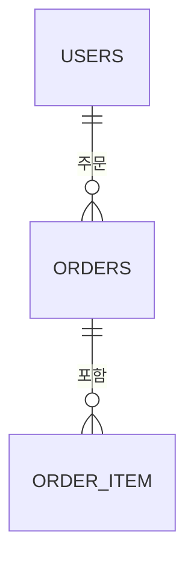

# Phase Report 작성 규칙

이 규칙은 `docs/phases/<phase>/report.md`를 작성할 때 따른다.

`report.md`는 내부 작업 메모가 아니다. 처음 보는 사람이 이 문서만 읽고도 무엇을 확인하려 했는지, 어떤 데이터와 테이블 상태에서 측정했는지, 어떤 결과가 나왔는지, 왜 그런 결과가 나왔는지 이해할 수 있어야 한다.

## 기본 원칙

- 한국어로 작성한다.
- 두괄식으로 작성한다. 핵심 결론과 중요한 수치는 앞부분에서 먼저 말한다.
- 고정된 마크다운 템플릿을 강제하지 않는다. 증거의 종류와 Phase 성격에 맞게 구조를 잡는다.
- 우리만 아는 표현을 쓰지 않는다. 처음 읽는 사람이 바로 이해할 수 있는 말로 상황을 설명한다.
- 나온 결과를 기준으로 쓴다. 추측은 결론처럼 쓰지 않고 회고나 보완사항에 따로 남긴다.
- 원본 로그를 길게 붙여 넣지 않는다. 보고서는 결과 해석 문서이고, 원본 증거는 링크로 연결한다.
- “느리다”, “좋다”, “병목이다”, “개선됐다”처럼 판단만 쓰지 않는다. 반드시 수치와 근거를 함께 쓴다.
- 추상적인 표현, 애매한 표현, 감정적인 표현을 쓰지 않는다.
- 가능한 모든 핵심 주장은 수치, 파일, 실행 조건 중 하나 이상의 근거와 함께 쓴다.

## 작성 전 결과 타당성 판단

`report.md`를 작성하기 전에 먼저 현재 결과로 보고서를 쓸 수 있는지 판단한다.

이 판단은 별도 설명을 많이 붙이지 않고, 아래 정보만으로 한다.

- 이번 Phase에서 확인하려던 내용
- 실험을 어떻게 했는지
- 데이터와 테이블 상태
- 실제 결과 수치
- 결과 수치의 원본 증거

이 정보만 보고도 결과가 일리 있는지 판단할 수 있어야 한다. 판단이 되지 않으면 `report.md`를 먼저 쓰지 않는다.

작성 가능 여부를 판단할 때는 아래 자료만 본다.

필수로 보는 자료:

- Phase에서 확인하려는 내용을 설명한 문서
- evidence README 또는 케이스별 evidence index
- 케이스별 실행 조건을 고정한 `measurement.json`
- 테스트 대상 테이블의 행 수, 인덱스, 제약조건, 관계 상태를 보여주는 DB 상태 자료
- 실제 결과 수치를 담은 원본 파일

조건에 따라 보는 자료:

- k6를 사용했다면 `k6-summary.json`, `k6-exit-status.txt`, `run-window.json`
- SQL 실행계획을 근거로 쓴다면 `EXPLAIN`과 `EXPLAIN ANALYZE` 결과
- 반복 쿼리나 DB 실행 시간을 근거로 쓴다면 `pg_stat_statements`
- Grafana나 Prometheus 흐름을 근거로 쓴다면 해당 시간대의 Grafana 링크, screenshot, Prometheus export

작성 가능 여부를 판단할 때는 아래 자료를 기본 근거로 삼지 않는다.

- 과거 작업 계획
- 사람이 실행한 명령을 설명하는 runbook
- 코드만 보고 추정한 원인
- 원본 증거 없이 사람이 정리한 최종 숫자

작성 전에는 아래를 확인한다.

- 테스트 케이스별 실행 조건이 구분되어 있는가
- 데이터 행 수, 인덱스, 제약조건, 관계 상태가 결과 해석에 충분한가
- k6를 사용했다면 실행 시간, 요청량, 시간 제한, 실패율, p95, p99, dropped iterations, 종료 코드가 서로 모순되지 않는가
- SQL 실행계획을 사용했다면 쿼리 조건, 실제 처리 시간, row, loops, buffers가 결과 해석에 충분한가
- `pg_stat_statements`를 사용했다면 calls, mean time, total time이 k6 결과와 같은 방향을 가리키는가
- Grafana나 Prometheus를 사용했다면 실행 시간대가 해당 테스트 케이스와 맞는가
- 여러 케이스의 결과가 섞이지 않았는가
- 결과가 예상과 다르면 그 차이를 설명할 수 있는 증거가 있는가

판단 결과는 셋 중 하나로 본다.

| 상태 | 의미 | 처리 |
|---|---|---|
| `작성 가능` | 실행 조건과 결과가 서로 맞고, 핵심 주장을 수치로 설명할 수 있다. | `report.md`를 작성한다. |
| `한계 명시 후 작성 가능` | 결과는 사용할 수 있지만 일부 수치나 보조 증거가 부족하다. | 부족한 점을 회고와 보완사항에 명시하고 작성한다. |
| `재실험 필요` | 실행 조건이 불명확하거나 결과가 서로 모순되어 결론을 쓰기 어렵다. | `report.md`를 작성하지 않고 실험을 다시 하거나 증거를 보강한다. |

`한계 명시 후 작성 가능` 또는 `재실험 필요`로 판단되면, `report.md`를 작성하기 전에 사용자에게 먼저 알린다.

사용자에게 알릴 때는 아래를 구체적으로 말한다.

- 어떤 케이스에서 문제가 발견됐는지
- 어떤 수치가 이상하거나 부족한지
- 왜 그 수치만으로 결론을 쓰기 어려운지
- 다시 확인해야 할 원본 증거가 무엇인지
- 재실험이 필요하다면 어떤 조건을 고정해서 다시 실행해야 하는지
- 증거 보강만으로 충분하다면 어떤 파일이나 수치를 추가로 남기면 되는지

나쁜 보고:

- “결과가 좀 이상합니다.”
- “다시 해보는 게 좋겠습니다.”
- “증거가 부족합니다.”

좋은 보고:

- “`points page500` 케이스에서 k6 p95는 5.07초로 timeout 근처지만, 해당 실행의 `run-window.json`이 없어 Grafana 시간 범위를 맞출 수 없습니다. k6 summary와 `pg_stat_statements`만으로 SQL 병목은 설명할 수 있으나 Hikari 지표는 근거로 쓰기 어렵습니다. Grafana 지표까지 보고서에 쓰려면 같은 케이스를 다시 실행하거나 해당 실행 시간 범위를 확인할 수 있는 파일을 추가로 남겨야 합니다.”

`재실험 필요`에 해당하는 예:

- 어떤 조건으로 실행했는지 알 수 없는 k6 결과
- p95, p99, 실패율은 있지만 실행 시간이나 요청량을 알 수 없는 결과
- DB 행 수나 인덱스 상태가 확인되지 않은 SQL 성능 결과
- Grafana 시간 범위가 실제 k6 실행 시간과 맞지 않는 결과
- 서로 다른 pool, preset, 케이스 결과가 한 표에 섞인 결과
- 원본 증거 없이 최종 숫자만 남은 결과

## 작성 전 구조 설계

`report.md`를 바로 쓰기 시작하지 않는다. 먼저 읽는 사람이 어떤 순서로 이해해야 하는지 생각하고 보고서 구조와 목차를 잡는다.

구조를 잡을 때는 아래 순서를 기본 흐름으로 삼는다. 이 순서를 제목으로 강제하지는 않지만, 처음 읽는 사람이 자연스럽게 따라갈 수 있어야 한다.

1. 이번 Phase에서 확인하려는 내용
2. 결과를 먼저 요약한 결론
3. 결과 해석에 필요한 데이터와 테이블 상태
4. 케이스별 측정 조건
5. 케이스별 결과 수치
6. SQL 실행계획 또는 내부 쿼리 동작
7. 결과가 나온 이유
8. 다음 Phase에서 비교할 기준
9. 회고와 보완사항
10. Grafana 대시보드와 사용한 근거 링크

테스트 케이스가 여러 개면 전체 요약을 먼저 쓰고, 각 케이스는 조건, 결과, 해석이 섞이지 않게 분리한다.

## 문서가 반드시 설명해야 하는 내용

아래 항목은 특정 제목으로 고정하지 않아도 된다. 다만 문서 안에서 독자가 자연스럽게 확인할 수 있어야 한다.

- 이 Phase에서 무엇을 확인하려 했는지
- 어떤 상황을 기준으로 결과를 해석해야 하는지
- 어떤 테이블을 대상으로 했는지
- 대상 테이블에 데이터가 몇 건 있었는지
- 중요한 제약조건, 관계, 인덱스 상태가 무엇이었는지
- 테스트 케이스가 여러 개라면 각 케이스의 차이가 무엇인지
- k6를 사용했다면 부하를 어떻게 줬는지
- SQL 실행계획을 봤다면 어떤 쿼리를 어떤 조건으로 확인했는지
- 최종 수치가 무엇인지
- 그 수치가 어떤 증거 파일에서 나온 것인지
- 결과가 왜 그렇게 나왔는지
- 이론상 예상과 실제 결과가 다르다면 무엇이 달랐고 왜 그럴 수 있는지
- 다음 Phase에서 비교 기준으로 사용할 수 있는 수치가 무엇인지
- 보완하면 좋은 점이나 추가로 확인하면 좋은 점이 무엇인지
- Grafana 대시보드 링크와 보고서 작성에 사용한 주요 근거 링크가 무엇인지

## 데이터와 테이블 상태 설명

결과를 해석하려면 데이터와 테이블 상태가 먼저 이해되어야 한다.

보고서에는 필요한 범위 안에서 아래 정보를 설명한다.

- 테이블별 행 수(row count)
- 성능 판단에 영향을 주는 주요 컬럼
- 성능 판단에 영향을 주는 관계
- 성능 판단에 영향을 주는 제약조건
- 성능 판단에 영향을 주는 인덱스 유무
- 특정 케이스에서 데이터 분포가 중요하다면 해당 분포

테이블 구조가 복잡하거나 말로 설명하기 어렵다면 표나 Mermaid ERD를 사용한다.

예시:

표나 ERD를 사용할 때도 장식용으로 넣지 않는다. 결과 해석에 필요한 관계, 행 수, 인덱스 상태를 이해시키는 목적이어야 한다.

## k6 결과 작성 규칙

k6를 사용했다면 독자가 같은 부하 조건을 이해할 수 있어야 한다.

보고서에는 필요한 범위 안에서 아래 정보를 설명한다.

- 어떤 테스트 케이스였는지
- 얼마나 오래 실행했는지
- 초당 요청 수 또는 요청 생성 방식
- 사용할 수 있는 가상 사용자 수
- 시간 제한(timeout)
- 대상 요청의 주요 파라미터
- Spring 실행 설정이나 커넥션 풀 조건처럼 결과에 영향을 주는 실행 조건

결과 수치는 `k6-summary.json`을 기준으로 쓴다.

주요 수치는 케이스별로 정리한다.

- 요청 수
- 초당 요청 수
- 실패율
- p95
- p99
- dropped iterations(k6가 시작하지 못한 반복 수)
- k6 종료 코드

Grafana나 Prometheus의 p95, p99는 실행 중 흐름을 설명하는 보조 증거로 사용한다. 최종 표의 기준 수치로 사용할 때는 왜 k6 summary 대신 그 값을 썼는지 설명한다.

## SQL과 실행계획 작성 규칙

SQL 실행계획을 근거로 쓰는 경우, 단순히 “Seq Scan이다” 또는 “Index Scan이다”라고만 쓰지 않는다.

보고서에는 필요한 범위 안에서 아래 정보를 설명한다.

- 어떤 쿼리를 확인했는지
- 옵티마이저가 어떤 실행계획을 선택했는지
- 실제 처리 시간이 얼마였는지
- 실제 반환 row와 처리 row가 어느 정도였는지
- loops, buffers처럼 결과 해석에 중요한 실행계획 값
- 예상 row와 실제 row가 크게 다르면 그 차이가 어떤 의미인지

`pg_stat_statements`를 사용했다면 아래 수치를 함께 본다.

- calls
- mean time
- total time
- rows

SQL 수치는 k6 결과와 연결해서 해석한다. 예를 들어 HTTP p95가 높다면 어떤 SQL이 반복되었는지, 어떤 쿼리가 DB 시간을 많이 사용했는지 같이 설명한다.

## 케이스별 작성 규칙

테스트 케이스가 여러 개라면 케이스별로 조건, 결과, 해석을 분리한다.

각 케이스는 다음 질문에 답할 수 있어야 한다.

- 이 케이스는 무엇을 확인하려고 만든 것인가
- 다른 케이스와 무엇이 다른가
- 실제 수치는 어떻게 나왔는가
- 그 수치의 근거 파일은 무엇인가
- 왜 그런 결과가 나왔다고 볼 수 있는가
- 다음 케이스나 다음 Phase와 비교할 때 어떤 수치를 기준으로 삼을 것인가

## 해석 작성 규칙

해석은 증거에서 나온 값으로만 작성한다.

좋은 해석은 아래 형태를 가진다.

- 관찰한 수치를 먼저 말한다.
- 그 수치가 나온 쿼리, 테이블 상태, 데이터 분포, 부하 조건을 연결한다.
- 결과가 의미하는 바를 설명한다.
- 확실하지 않은 부분은 확실하지 않다고 쓴다.
- 추가 확인이 필요한 내용은 회고나 보완사항에 둔다.

나쁜 해석:

- “N+1 때문에 느리다.”
- “인덱스가 없어서 병목이다.”
- “pool을 키우면 해결될 것 같다.”

좋은 해석:

- “요청 14,519건이 모두 실패했고 p95는 5초 timeout 근처였다. 같은 실행에서 `order_item` 단건 조회가 13,060회 발생했으며 평균 실행 시간은 139.39ms였다. 따라서 이 케이스의 주된 근거는 HTTP 지연 시간만이 아니라 반복 SQL 호출 수와 DB 실행 시간이다.”

애매한 표현은 수치로 바꿔 쓴다.

| 피해야 할 표현 | 바꿔 쓸 방향 |
|---|---|
| 많이 느렸다 | p95, p99, 평균 시간, timeout 비율을 쓴다. |
| 성능이 좋아졌다 | 개선 전후 수치와 변화율을 쓴다. |
| 병목이 심했다 | 어떤 쿼리의 calls, mean time, total time이 얼마였는지 쓴다. |
| 데이터가 많았다 | 테이블 행 수와 케이스에 영향을 준 분포를 쓴다. |
| 예상과 달랐다 | 예상한 값, 실제 값, 차이를 만든 가능성이 있는 증거를 쓴다. |

## 회고와 보완사항

보고서 마지막에는 결과를 과장하지 않고, 다음에 더 명확히 해야 할 점을 남긴다.

회고에는 아래 내용을 둘 수 있다.

- 측정에서 부족했던 증거
- 결과 해석에서 아직 확실하지 않은 부분
- 추가하면 좋은 테스트 케이스
- 더 정확한 비교를 위해 필요한 데이터 상태
- 다음 Phase에서 확인해야 할 수치

회고는 실패를 숨기는 공간이 아니다. 현재 결과로 말할 수 있는 것과 아직 말할 수 없는 것을 구분하는 공간이다.

## 마지막 링크 정리

보고서 마지막에는 Grafana 대시보드 링크와 보고서 작성에 사용한 주요 근거 링크를 모아 둔다.

Grafana 링크는 가능하면 실행 케이스를 확인할 수 있는 시간 범위나 dashboard variable 값이 포함된 링크를 사용한다. 고정된 시간 범위 링크가 없다면 어떤 evidence run의 어느 시간대를 봐야 하는지 함께 적는다.

근거 링크는 보고서 본문에서 사용한 핵심 파일만 둔다. 모든 원본 파일을 나열하지 않는다.

링크 정리에는 필요한 범위 안에서 아래 항목을 포함한다.

- Grafana 대시보드
- k6 summary
- `pg_stat_statements`
- SQL `EXPLAIN` / `EXPLAIN ANALYZE`
- DB 행 수, 인덱스, 제약조건 확인 자료
- Prometheus export 또는 Grafana capture

## 금지 사항

- 내부자만 이해하는 축약어와 별칭만으로 설명하기
- 추상적이거나 감정적인 표현으로 결과를 설명하기
- 증거 없이 결론부터 단정하기
- 나온 수치가 없는데 개선 효과를 추정해서 쓰기
- 케이스가 여러 개인데 결과를 한 문단에 섞어서 쓰기
- 테이블 행 수, 인덱스 상태, 제약조건 상태 없이 DB 성능 결과를 해석하기
- k6 부하 조건 없이 p95, p99, 실패율만 쓰기
- SQL 실행계획의 실제 처리 시간과 row 정보를 보지 않고 실행계획 이름만 쓰기
- Grafana screenshot만으로 최종 성능 수치를 확정하기
- 원본 증거를 보고서 본문에 길게 붙여 넣기
- 보고서 마지막에 Grafana 대시보드와 주요 근거 링크를 남기지 않기
