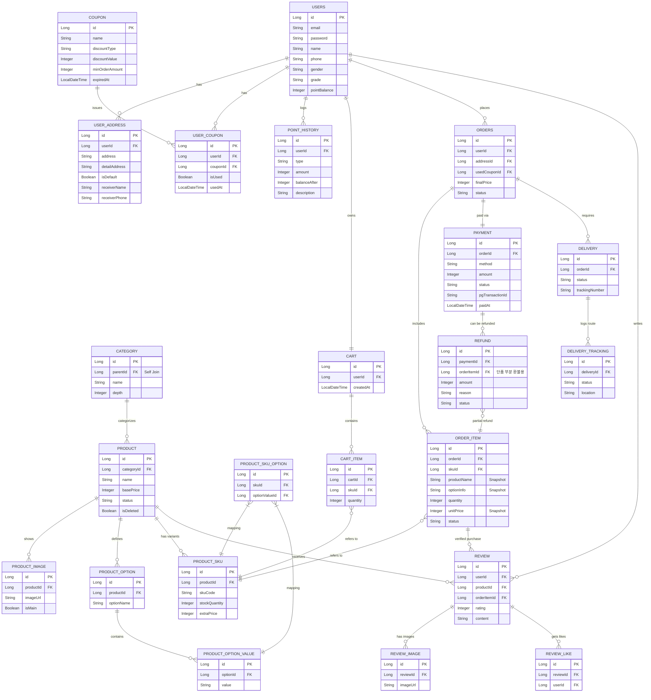

# E-Commerce ERD 및 데이터베이스 아키텍처 분석서

본 문서는 이커머스 시스템의 엔티티 구조와 설계 의도, 그리고 핵심 비즈니스 로직을 데이터베이스 모델링 관점에서 정리한 문서입니다. 각 도메인별 테이블 구조와 조인 전략, 정규화/비정규화 등 주요 설계 결정을 포함합니다.

---

## 1. 핵심 설계 철학 (Design Philosophy)

본 프로젝트의 데이터베이스 설계는 다음의 원칙을 따릅니다.

1. **상황에 맞는 비정규화 (의도된 데이터 중복)**: 과거의 주문 데이터를 **스냅샷** 형태로 보존하고 조인 연산을 줄이기 위해 일정 부분 비정규화를 도입합니다. (예: `OrderItem`의 상품명 저장)
2. **트랜잭션(State)과 로그(Log)의 분리**: 현재 상태를 나타내는 마스터 엔티티와, 과거부터의 상태 변화 이력을 모두 기록하는 로깅 엔티티를 분리하여 데이터 조회 성능과 추적 기능을 동시에 잡습니다. (예: `Delivery` vs `DeliveryTracking`)
3. **핵심 재고 단위의 추상화**: 겉으로 보이는 '상품'과 실제 창고에서 관리되는 '재고' 단위를 명확히 분리하여 유연한 옵션 관리를 지원합니다. (예: `Product` vs `ProductSku`)

---

## 2. ERD 다이어그램 (Mermaid)

아래는 주요 도메인 그룹별 릴레이션을 단순화하여 표현한 다이어그램입니다.

---

## 3. 도메인별 핵심 설계 분석

### 3.1. 상품 전시 및 재고 도메인 (Product & Sku)
이커머스의 가장 기본이 되는 뼈대로, 사용자에게 보여지는 화면과 재고 관리의 현실을 조율합니다.

*   `Product`: 쇼핑몰에 진열되는 대표 상품의 껍데기입니다.
*   `ProductOption` & `ProductOptionValue`: "색상(빨강, 파랑)", "사이즈(S, M, L)" 등 옵션의 종류와 구체적 값을 정의하는 사전(Dictionary) 역할을 합니다.
*   **`ProductSku` (핵심)**: 실제 판매되는 최소 재고 단위(Stock Keeping Unit)입니다. 사용자는 `Product`를 보고 들어오지만, 장바구니에 담고 결제하는 모든 기준은 이 `ProductSku`가 됩니다.
*   `ProductSkuOption`: 다대다(N:M) 매핑 중간 테이블로, 특정 SKU가 어떤 옵션 값들의 조합(예: 빨간색 + L사이즈)인지 연결해 줍니다.

### 3.2. 장바구니 도메인 (Cart)
결제 문턱을 넘기 직전의 고객 의도를 담아둡니다.

*   `Cart`: 회원당 1개씩 존재하는 장바구니 마스터(Header)입니다. 주문 시스템 구조와의 통일성, 전체 일괄 비우기, 사용자 세션 유지 관리의 용이성을 위해 단일 테이블 구조 대신 분리 설계되었습니다.
*   `CartItem`: 회원이 담아둔 구체적 SKU들입니다. 스냅샷(가격/상품명)을 가지지 않고 **오직 `skuId`만 연결**하여, 사용자가 나중에 접속했을 때 최신 변경 가격을 즉각 반영하도록 설계되었습니다.

### 3.3. 주문 도메인 (Order)
거래 행위의 코어이며, 결제/배송 등 모든 하위 프로세스의 시작점입니다.

*   `Orders`: 어떤 사용자가 언제 총 얼마의 금액으로 물건들을 샀는지 요약된 헤더입니다.
*   **`OrderItem` (비정규화 하이라이트)**: 
    *   **스냅샷 기법**: 주문 시점의 `productName`, `unitPrice`를 직접(중복) 저장합니다. 이로 인해 사후에 상품 정보가 변경되더라도 고객의 결제 당시 영수증 내역(데이터 무결성)을 영구 보존할 수 있습니다.
    *   **조인 최적화**: 사용자의 주문 내역(마이페이지)을 그릴 때, 복잡한 상품 테이블까지 Join할 필요 없이 `OrderItem` 하나만 읽어도 화면 구성을 끝낼 수 있도록 쿼리 최적화의 토대를 제공합니다.

### 3.4. 결제 도메인 (Payment & Refund)
외부 시스템(PG사)과의 통신 및 금액 정합성을 다룹니다.

*   `Payment`: 실제 외부를 통해 승인된 결제 이력.
    *   **상호 검증 로직**: `Orders.finalPrice(우리 시스템 책정 금액)`와 `Payment.amount(PG사 승인 금액)`를 대조하여 클라이언트 단의 금액 변조 해킹 등을 방어합니다.
*   `Refund`: 특정 결제건에 대한 환불 내역.
    *   **부분 환불(단품 취소)**: `Orders` 대신 **`OrderItem`**의 FK를 가집니다. 이를 통해 전체 10만 원어치 결제 중, 불량이 발생한 단일 품목(3만 원 품목 등)만 정밀하게 콕 집어 취소하는 '부분 환불' 시스템을 지원합니다.

### 3.5. 배송 도메인 (Delivery)
물리적인 화물의 이동 상태를 추적합니다.

*   **상태 vs 로그 분리 패턴**:
    *   `Delivery`: 배송의 '최신 상태'(결제완료, 배송중 등). 어플리케이션 내의 빠른 조회 및 처리를 담당합니다. 결제 직후에는 운송장(trackingNumber)이 null 이었다가, 택배사 인계 시점에 Update 됩니다.
    *   `DeliveryTracking`: Append-Only 테이블로, 옥천 HUB -> 강남 대리점 -> 배송 완료 등의 스텝 바이 스텝 물류 흐름을 기록합니다. 과거 데이터 누적으로 인해 대용량 데이터베이스 Pagination 최적화 실험(Phase 7)에 주요하게 쓰일 수 있습니다. (cf. `PointHistory` 테이블과 동일 설계 구조)

### 3.6. 커뮤니티 도메인 (Review)
*   `Review`: 사용자의 상품 평판 기록.
    *   `productId`와 더불어 **`orderItemId`**를 식별자로 같이 가짐으로써, 실제 해당 상품을 돈을 지불하고 산 100% "구매자"만 맹목적으로 리뷰를 남길 수 있게 제한(내돈내산)하고 신뢰도를 담보합니다.

---

## 4. 향후 운영 및 최적화 전략 (Next Steps)

1. **조인 최적화 유도 (QueryDSL 적용)**:
   이처럼 분절된 테이블 구조에서는 `Users`, `Orders`, `OrderItem`, `Payment`, `Delivery` 등을 조회 시 데이터 접근 범위가 기하급수적으로 늘어납니다. N+1 문제를 방지하고 화면의 요구사항성격에 맞춰 최적 Join 전략(Fetch Join)을 구사해야 합니다.
2. **복합 인덱스 확장 설계 (Phase 2)**:
   외래키(FK) 컬럼 외에도 사용자가 자주 검색하는 조건들(예: "배송중인 내 주문 목록", "최근 1주일간 포인트 사용 내역")에 타겟팅된 인덱스 튜닝이 필수적입니다.
